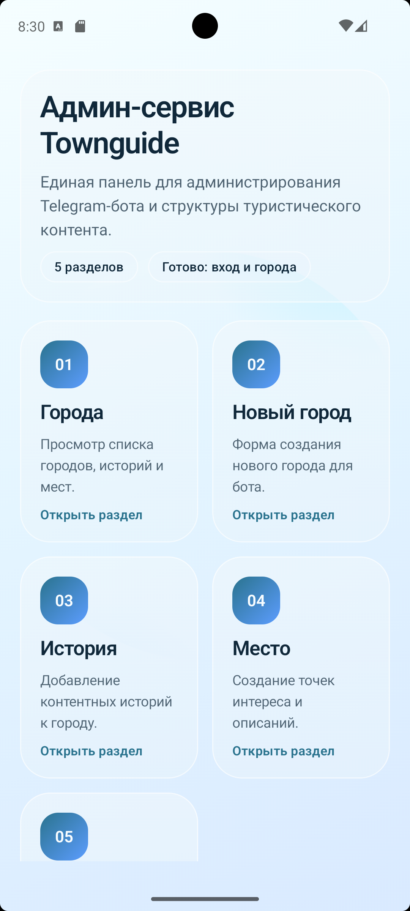
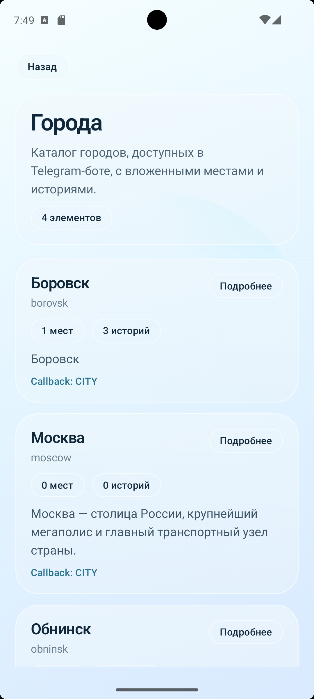
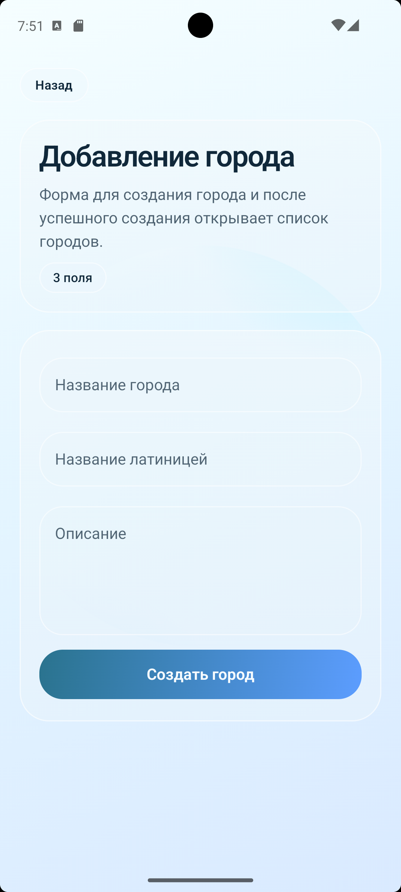
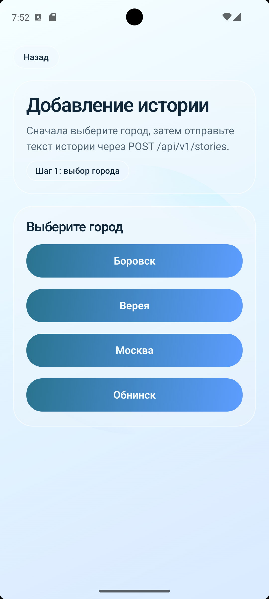
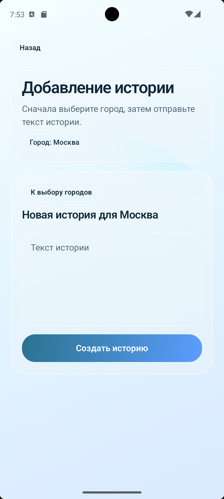

# Townguide Android Admin

Android-приложение для администрирования контента Telegram-бота.  
Клиент предназначен для внутренних админских сценариев: вход по учётной записи администратора, просмотр каталога городов, создание новых городов и добавление историй с привязкой к выбранному городу.

## Содержание

1. [О проекте](#о-проекте)
2. [Разделы меню](#разделы-меню)
4. [Скриншоты](#скриншоты)
5. [Технологический стек](#технологический-стек)
6. [Архитектура](#архитектура)
7. [Backend API](#backend-api)
8. [Запуск проекта](#запуск-проекта)
9. [Конфигурация API](#конфигурация-api)
10. [Структура проекта](#структура-проекта)
11. [Планы развития](#планы-развития)

## О проекте

Townguide Android Admin решает одну задачу: дать администратору быстрый мобильный интерфейс для управления туристическим контентом.

Текущий фокус приложения:

- авторизация администратора;
- сохранение JWT-токена на устройстве;
- автоматический переход в админ-панель при наличии валидной сессии;
- просмотр списка городов вместе с вложенными историями и местами;
- создание нового города;
- создание истории с предварительным выбором города.


## Разделы меню

Главное меню администратора содержит 5 разделов:

| Раздел | Назначение | Текущее состояние |
|---|---|---|
| Города | Просмотр каталога городов, историй и мест | Работает |
| Новый город | Создание новой карточки города | Работает |
| История | Добавление новой истории к выбранному городу | Работает |
| Место | Создание точки интереса | Заглушка |
| Фото | Загрузка и привязка медиа | Заглушка |

## Скриншоты

### Дашборд



### Города

<p>
  
  
</p>

### История

<p>
  
  
</p>

## Технологический стек

| Язык | Kotlin |
|---|---|
| UI | Jetpack Compose, Material 3 |
| Навигация | Navigation Compose |
| Сетевой слой | Retrofit, Gson Converter, OkHttp |
| Хранение сессии | DataStore Preferences |
| Архитектура экранов | Compose + ViewModel + StateFlow |
| Android SDK | minSdk 24 / targetSdk 36 / compileSdk 36 |
| JVM target | Java 11 |

## Архитектура

Проект разделён на два крупных слоя:

- `data`  
  Сетевые API-интерфейсы, DTO-модели, interceptor для токена, локальное хранилище авторизации.
- `ui`  
  Compose-экраны, ViewModel, навигация, общие UI-компоненты и тема приложения.

Основной runtime-поток выглядит так:

1. `SplashScreen` проверяет наличие токена.
2. Пользователь попадает либо на экран логина, либо сразу в админ-панель.
3. После успешного логина токен сохраняется в `DataStore`.
4. `AuthInterceptor` автоматически добавляет `Authorization: Bearer <token>` к backend-запросам.
5. Администратор переходит в нужный раздел через дашборд.

## Backend API

Приложение уже интегрировано со следующими backend-ручками:

| Метод | Endpoint | Назначение |
|---|---|---|
| `POST` | `/auth/login` | Авторизация администратора |
| `GET` | `/api/v1/city` | Получение списка городов |
| `POST` | `/api/v1/city` | Создание нового города |
| `POST` | `/api/v1/stories` | Создание новой истории |

### Используемые модели

#### `CityCreateRequest`

```json
{
  "name": "Боровск",
  "nameEng": "borovsk",
  "description": "Исторический город..."
}
```

#### `StoryCreateRequest`

```json
{
  "cityId": 1,
  "body": "Боровск был основан в 1358 году..."
}
```

#### `CityResponse`

Возвращает:

- идентификатор города;
- название и английское имя;
- описание;
- callback-код;
- ссылку на фото;
- список `places`;
- список `stories`.

## Запуск проекта

### Требования

- Android Studio с поддержкой Kotlin Compose;
- Android SDK 36;
- JDK 11;
- локально запущенный backend Townguide API;
- доступный endpoint авторизации и админских API.

### Быстрый старт

1. Откройте проект в Android Studio.
2. Убедитесь, что backend доступен локально.
3. Проверьте базовый URL API в `app/build.gradle.kts`.
4. Запустите приложение на эмуляторе или устройстве.
5. Войдите под учётной записью администратора API.

### Сборка из терминала

macOS / Linux:

```bash
./gradlew assembleDebug
```

Windows:

```powershell
gradlew.bat assembleDebug
```

### Проверка компиляции Kotlin

macOS / Linux:

```bash
./gradlew :app:compileDebugKotlin
```

Windows:

```powershell
gradlew.bat :app:compileDebugKotlin
```

## Конфигурация API

По умолчанию приложение использует:

```kotlin
buildConfigField("String", "API_BASE_URL", "\"http://10.0.2.2:8080/\"")
```

Это удобно для Android Emulator, где `10.0.2.2` указывает на localhost машины разработки.

### Если вы запускаете приложение:

- в эмуляторе Android  
  Оставьте `http://10.0.2.2:8080/`
- на физическом устройстве  
  Замените `API_BASE_URL` на IP-адрес вашей машины в локальной сети, например `http://192.168.1.10:8080/`

### Важные детали

- в `AndroidManifest.xml` включён `INTERNET`;
- для dev-режима разрешён cleartext HTTP;
- JWT-токен сохраняется локально через DataStore;
- токен автоматически подставляется в заголовок `Authorization`.

## Структура проекта

```text
townguide/
├── app/
│   ├── src/main/java/io/project/townguide/android/
│   │   ├── data/
│   │   │   ├── network/
│   │   │   │   ├── api/
│   │   │   │   └── dto/
│   │   │   └── storage/
│   │   ├── ui/
│   │   │   ├── cities/
│   │   │   ├── citycreate/
│   │   │   ├── common/
│   │   │   ├── components/
│   │   │   ├── dashboard/
│   │   │   ├── login/
│   │   │   ├── navigation/
│   │   │   ├── splash/
│   │   │   ├── storycreate/
│   │   │   └── theme/
│   │   ├── MainActivity.kt
│   │   └── TownguideApp.kt
│   └── build.gradle.kts
├── gradle/
├── build.gradle.kts
└── settings.gradle.kts
```

## Планы развития

Ближайшие логичные шаги для проекта:

- реализовать создание мест;
- реализовать загрузку фотографий;
- добавить редактирование и удаление сущностей;
- покрыть ViewModel тестами;
- вынести repository-слой между UI и Retrofit;
- добавить поддержку разных окружений через build types или product flavors;
- подключить CI-проверки сборки и статического анализа.

## Статус проекта

Проект находится в стадии активной разработки и уже пригоден для базовых админских сценариев:

- вход администратора;
- просмотр городов;
- создание городов;
- создание историй.

Остальные разделы админки подготовлены на уровне навигации и UI-каркаса и могут быть расширены без изменения общей архитектуры.
